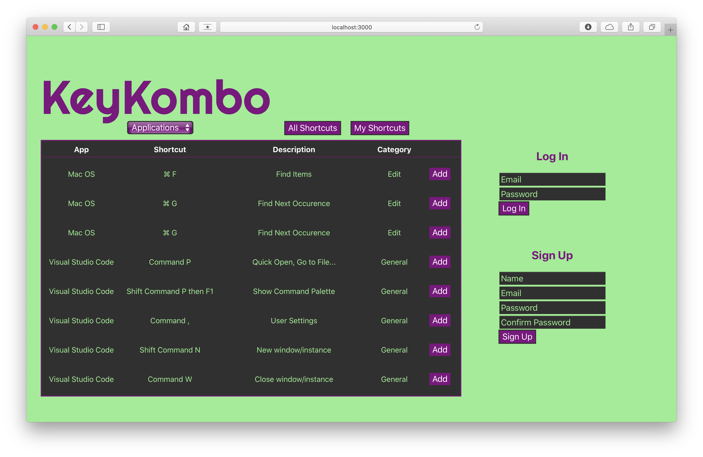
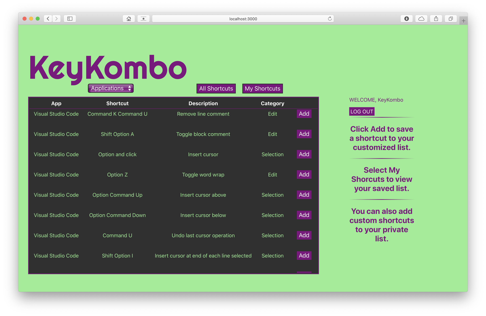
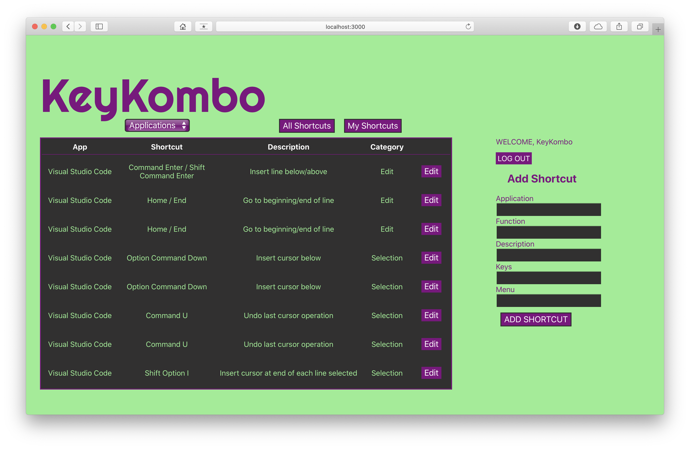
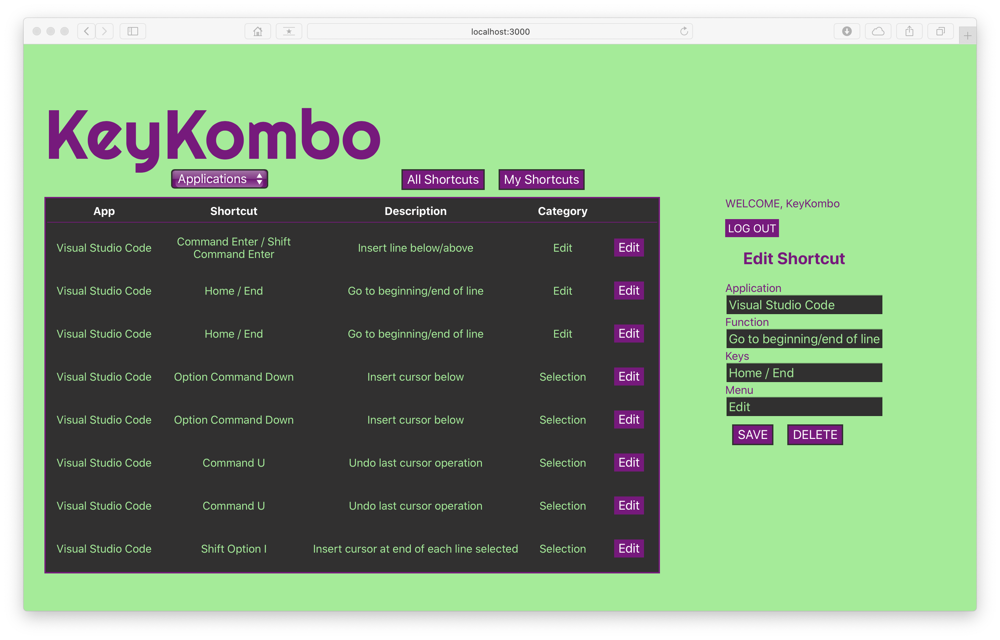

<h1>KeyKombo</h1>

<h4>Screen Captures</h4>

<h4>Technologies Used:</h4>

  	React
    MongoDB
    Mongoose
    HTML
  	JavaScript
    CSS
    Heroku

<h4>Getting Started:</h4>

[KeyKombo](https://keykombo.herokuapp.com)
	
[Trello Board](https://trello.com/b/X3A42o3a/keykombo)

<h4>Next Steps:</h4>

* Search shortcuts functionality
* Filter by category of shortcut
* Submit shortcuts for approval and entry to master list
* Find conflicting shortcuts on your system
* Admin ability to upload application shortcuts in bulk